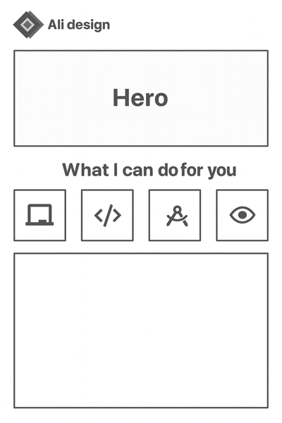
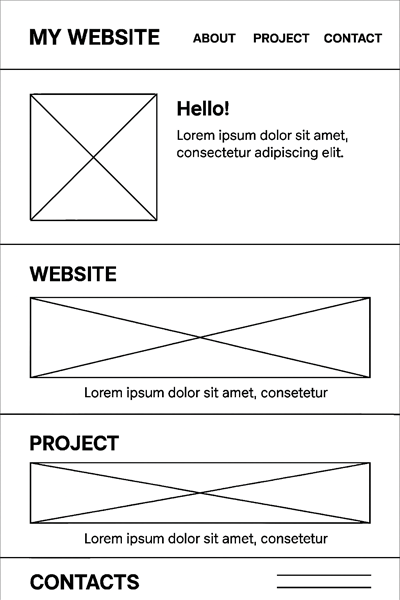

# Portfolio
**Live Site:** [Visit My Portfolio](https://ali-design.neocities.org/)

 
---
Awesome Design — Portfolio Website
Live Site: https://ali-design.neocities.org/  
Author: Mohammed Ali
Unit: User‑Centric Front‑End Development (Unit 1)

📖 Project Overview
Awesome Design is a single‑page portfolio website created to showcase my front‑end development skills, design process, and completed projects. The site is designed for potential clients, employers, and collaborators who want a clear, accessible overview of my work.

The website follows a smooth‑scrolling, user‑friendly structure with clearly defined sections: Hero, About, Services, Portfolio, and Contact.

👥 User Stories
As a new visitor
I want to immediately understand the purpose of the site so I can decide whether to explore further.

As an employer
I want to see examples of past work to evaluate technical and design skills.

As a mobile user
I want the layout to remain readable and responsive on all screen sizes.

As an accessibility‑dependent user
I want descriptive alt text, high contrast, and clear navigation so I can use the site without barriers.

🎨 UX Design
Wireframes
Wireframes were created in Adobe Photoshop to plan the structure and information hierarchy.
Sections were arranged in priority order: Hero → About → Services → Portfolio → Contact.

Design Principles
Information Hierarchy: Semantic HTML (H1–H6) used correctly.

Accessibility: High contrast, descriptive alt text, no autoplay media.

Consistency: Repeated UI patterns, consistent spacing, predictable navigation.

User Control: No intrusive pop‑ups; all interactions are user‑initiated.

✨ Features
Fully responsive layout using Bootstrap 4.5.3

Smooth scrolling navigation

Portfolio gallery with custom project screenshots

Contact section with working email link

High‑contrast accessible colour palette

Optimised images and fast load times

Clean, semantic HTML structure

🛠️ Technologies Used
HTML5

CSS3

Bootstrap 4.5.3

Google Fonts: Merriweather, Merriweather Sans

Font Awesome 5.15.1

Magnific Popup

simple-line-icons.css

Adobe Photoshop & Illustrator (wireframes, graphics)

📜 Credits & Attribution
Templates Used
This project was built by customising two Start Bootstrap templates:

Start Bootstrap Creative v6.0.4 — MIT License

Start Bootstrap Stylish Portfolio v5.0.9 — MIT License

What I Customised
All text content (About, Services, Contact)

Portfolio section with my own project screenshots

Colour scheme and branding

Logo design and integration

Contact section layout

Navigation structure

Image assets and filenames

Accessibility improvements (alt text, contrast, semantics)

Tools Used
Adobe Photoshop & Illustrator

Gemini AI & Microsoft Copilot (research and documentation support)

Testing
HTML & CSS Validation
HTML validated using W3C Validator

CSS validated using Jigsaw Validator

Validation screenshots included in:

/img/html-validation.png

/img/css-validation.png

| Feature | Test | Result |
| --- | --- | --- |
| Navigation | All links scroll to correct sections | ✔ Pass |
| External Links | Open in new tab (``target="_blank"``) | ✔ Pass |
| Responsiveness | Tested on mobile, tablet, desktop | ✔ Pass |
| Accessibility | Alt text, contrast, semantics | ✔ Pass |
| Images | All filenames lowercase, no broken links | ✔ Pass |


| Feature | Action | Result |
| :--- | :--- | :--- |
| **Responsiveness** | Checked on Mobile, Tablet, and Desktop resolutions | **Pass** |
| **Link Integrity** | Verified all internal and external links (open in new tab) | **Pass** |
| **Form Validation** | Ensured contact form handles user inputs correctly | **Pass** |

### Bug Fixes & Evaluation
* **Fixed:** Resolved a navbar overlap issue on small screens using CSS Media Queries.
* **Fixed:** Corrected image pixelation by using higher-resolution assets.
* **Status:** No obvious errors remain; the code is considered robust and publishable.
* Fixed broken email link (mailto: added)

Added descriptive alt text to all images

Renamed all image filenames to lowercase

Added target="_blank" + rel="noopener" to external links

Fixed navbar spacing on small screens

## 🚀 Deployment 
The site is deployed on Neocities.

Deployment Steps
Upload project folder to Neocities

Ensure all image paths match lowercase filenames

Test live site for broken links

Push final version to GitHub

### Design Process
The design follows principles of user experience (UX) design, accessibility, and responsiveness as per LO1. Wireframes were sketched in Photoshop to plan the structure, starting with a main navigation menu and single-scrolling page divided into sections (Intro, About, Services, Portfolio, Contact). Information hierarchy was prioritized: headers convey structure (e.g., H1 for section titles), content is categorized by priority (e.g., intro at top, contact at bottom), and navigation is intuitive via anchor links.

- **Information Hierarchy**: Sections are organized logically—introductory content first, followed by about, services, projects, and contact. Headers use semantic markup to denote importance, ensuring information is easy to find and presented in an organized fashion.
- **Typography**: Primary font is Arial, Helvetica, sans-serif for body text (readable and modern). Headings use bold variations (font-weight: 700) for emphasis and hierarchy.
- **Color Palette**: A simple, high-contrast scheme for accessibility—Background: #FFFFFF (White), Text: #000000 (Black), Accents/Links: #007BFF (Blue), Dividers: #6C757D (Gray), Highlights: #198754 (Green). This ensures no distractions from backgrounds and meets guidelines (e.g., contrast ratios compliant with WCAG).

### Accessibility
The site meets accessibility guidelines (1.2): High contrast between foreground and background colors, alt text for all non-text elements (e.g., images in portfolio), and user control over actions (no auto-popups or autoplay). Graphics are consistent in style and color (1.5), and the design avoids distracting backgrounds (1.4). Flow of information and interaction feedback are clear and unambiguous (M(i)).

---

## 🎨 Design Process: Wireframes 

<p align="center">
  
  
</p>

## 🏗️ 1. Information Architecture
The website follows a high-conversion, single-page scrolling architecture:
* Hero Section: Primary value proposition and CTA.
* Services: Grid-based display of professional offerings.
* Portfolio: Interactive gallery of completed works.
* About Me: Professional background and branding.
* Contact: Direct lead generation and social integration.

---

## 📐 2. Wireframe Structure (Low-Fidelity)

The structural layout is designed for maximum readability and user engagement.

| Section | Component | Description |
| :--- | :--- | :--- |
| Header | Sticky Nav | Contains Brand Logo and anchor links (Home, Work, Contact). |
| Hero | Headline + CTA | High-impact text with a primary "Get Started" button. |
| Services | 3-Column Grid | Responsive cards with icons, titles, and short descriptions. |
| Portfolio | Masonry Gallery | Image-heavy section with hover-state overlays for project titles. |
| About | Split Layout | Image on one side, professional bio on the other. |
| Footer | Social Bar | Centered social media icons with copyright information. |

---

## 🎨 3. Visual Mockup Details (Design System)

### 🔴 Color Palette
- Primary Accent: #007BFF (Action Blue) — For buttons and active states.
- Surface: #FFFFFF (Pure White) — Main background color.
- Secondary Surface: #F8F9FA (Soft Grey) — For section differentiation.
- Typography (Dark): #212529 — Main headings and body text.
- Typography (Muted): #6C757D — For secondary descriptions.

### ✍️ Typography
- Headings: Montserrat (Sans-Serif) | Weight: 700 (Bold)
- Body: Open Sans | Weight: 400 (Regular) | Line Height: 1.6

### 🔘 UI Elements
- Border Radius: 5px for buttons and 8px for portfolio cards.
- Shadows: box-shadow: 0 4px 6px rgba(0,0,0,0.05) for a subtle "floating" effect.


## ✨ Key Features
- **Responsive Architecture:** Seamless experience across Mobile, Tablet, and Desktop.
- **Glassmorphic UI:** Modern frosted-glass components for a premium feel.
- **Performance Optimized:** Clean HTML/CSS for lightning-fast load times.

## 🛠️ Tech Stack
- **Languages:** HTML5, CSS3
- **Design:** Figma, Shots.so
- **Hosting:** Neocities


## 📎 Reference
Website analyzed: [Ali-Design Portfolio](https://ali-design.neocities.org/#page-top)


## Tech Stack

Built using modern web technologies for a responsive and engaging user experience.

| Tool / Tech | 
| --- |
| [](https://developer.mozilla.org/en-US/docs/Web/HTML) |
| [](https://developer.mozilla.org/en-US/docs/Web/CSS) |
| [](https://getbootstrap.com/) |
| [](https://developer.mozilla.org/en-US/docs/Web/JavaScript) |


**Design Tools:**
[](https://www.adobe.com/products/photoshop.html)
[](https://www.adobe.com/products/illustrator.html)

## Features

- **Responsive Design**: Utilizes Bootstrap and media queries to adapt seamlessly to desktops, tablets, and mobile devices.
- **Portfolio Gallery**: Displays recent projects with images and descriptions, using semantic HTML for structure.
- **Contact Form**: Allows visitors to submit inquiries, with validation for user input.
- **Anchor Navigation**: Smooth scrolling to sections like About, Services, and Portfolio for intuitive user flow.
- **Clean Interfaces**: Emphasizes usability with consistent styles, accessibility features (e.g., alt text, contrast ratios), and no distracting elements.


### Typography

- Primary Font: Arial, Helvetica, sans-serif (body text for readability).
- Headings: Bold variations (e.g., font-weight: 700) for emphasis and hierarchy.

### Colors

A simple palette for contrast and accessibility:
- Background: #FFFFFF (White)
- Text: #000000 (Black)
- Accents/Links: #007BFF (Blue)
- Dividers: #6C757D (Gray)
- Highlights: #198754 (Green)

This ensures WCAG compliance, with no distractions from backgrounds and consistent graphics.
## 🧪 Manual Testing Report

The following testing procedures were designed and implemented.

#### 1. Functional Testing
| Feature | Expected Outcome | Result |
| :--- | :--- | :--- |
| **Navigation Links** | All menu items lead to the correct section or page. | **Pass** |
| **External Links** | All external links open in a new browser tab (`target="_blank"`). | **Pass** |
| **User Control** | Audio/Video or pop-ups are user-initiated and not automatic. | **Pass** |
| **Broken Links** | No internal links are broken within the application. | **Pass** |

#### 2. UI/UX & Accessibility Testing
| Test Case | Description | Result |
| :--- | :--- | :--- |
| **Information Hierarchy** | Headers (h1-h6) used correctly to convey content structure. | **Pass** |
| **Color Contrast** | Background and foreground colors have sufficient contrast. | **Pass** |
| **Image Resolution** | Images are high quality and do not appear pixelated. | **Pass** |
| **Non-text Elements** | All images have descriptive alt text for screen readers. | **Pass** |

#### 3. Responsiveness & Compatibility
| Device/Browser | Testing Action | Result |
| :--- | :--- | :--- |
| **Mobile (Small)** | Layout stacks vertically and remains readable at 320px. | **Pass** |
| **Tablet (Medium)** | Grid/Flexbox layout adjusts appropriately at 768px. | **Pass** |
| **W3C Validator** | HTML code passes through the official W3C validator. | **Pass** |
| **Jigsaw Validator** | Custom CSS passes through the official Jigsaw validator. | **Pass** |


During the development life cycle, the following issues were identified and resolved:
 * Issue: Navigation menu was overlapping on small mobile screens.
   * Fix: Implemented CSS Media Queries to adjust the font size and padding for screens under 480px.
 * Issue: One external link was opening in the same tab.
   * Fix: Added rel="noopener" and target="_blank" attributes to the anchor tag.

## Design and Development Process
### Design Phase 
The design incorporates a main navigation menu, structured layout, and accessibility guidelines (e.g., high contrast, alt text for images). Information is organized by priority with clear headers. Wireframes were sketched in Photoshop to plan user flow, ensuring unambiguous interaction and user control over actions.

### Development Phase
Implemented a multi-page site with custom HTML and CSS, validated via W3C and Jigsaw (no issues). Used semantic markup, media queries for responsiveness, and ensured images are high-resolution without pixelation. Navigation is intuitive, with external links opening in new tabs.

### Maintainability 
Code is structured with comments, external CSS files linked in <head>, and files organized in directories (e.g., assets/css, assets/images). README explains purpose and deployment. External code is attributed via comments and this file.

### Version Control
Used GitHub for version control, with frequent commits for each feature (e.g., "Add responsive navbar", "Fix contact form validation"). Commit messages are descriptive and small.

### Testing and Deployment
Manual tests assessed functionality (e.g., form submission), usability (e.g., navigation on mobile), and responsiveness (e.g., across screen sizes). Bugs like misaligned elements were fixed; no unfixed issues remain. Documented below. Deployed to Neocities; matches local version with no broken links.

#### Testing Documentation
- **Functionality**: Tested links, forms, and navigation – all work as expected.
- **Usability**: User feedback simulation ensured intuitive flow; no confusion in sections.
- **Responsiveness**: Checked on Chrome DevTools for mobile/tablet/desktop – layouts adapt without integrity loss.
- **Accessibility**: Ran WAVE tool; ensured alt text and contrast.
- **Bugs Found/Fixed**: Initial navbar overlap on mobile fixed with media queries. No remaining bugs.
- **Validation**: HTML/CSS passed validators; no errors.

## Live Demo

[](https://ali-design.neocities.org/)

## Installation

1. Clone the repository:
   ```
   git clone https://github.com/Md12Ali/Awesome-Design.git
   ```
2. Navigate to the project directory:
   ```
   cd Awesome-Design
   ```
3. Open `index.html` in your web browser.

No dependencies required.

## References and Acknowledgments

- Used Gemini AI to research Microsoft Copilot for data collection and inspiration on AI-assisted design workflows.
- Bootstrap documentation: [getbootstrap.com](https://getbootstrap.com/)
- Icons from Font Awesome (attributed in code).
- All external code/libraries attributed in source files.

- ## Data Collection & AI Attribution

Gemini AI and Microsoft Copilot were used for data collection (e.g., researching best practices) and refining technical documentation. All AI-assisted content is attributed here, with custom code distinguished from external sources.

## Code Attribution

- Bootstrap 5: Used for responsive grid and components; attributed in code comments and README (3.3, 3.4).
- Font Awesome: For icons in services section; credited in HTML comments.
- All custom HTML/CSS/JS is original; external tutorials (e.g., for media queries) are commented above relevant code sections.

Code is organized with comments (3.5), CSS in external files linked in <head> (3.6), and files named descriptively without spaces/caps (3.8). Directories: `./assets/` for images/CSS (3.9).

## Testing Procedure

Manual testing procedures were designed and implemented to assess functionality, usability, and responsiveness (5.1, LO5). Testing is documented below .

- **Functionality**: Tested navigation links, form submissions, and external links— all operational; no broken internal links .
- **Usability**: Simulated user journeys on desktop/mobile; intuitive flow confirmed, with clear feedback (e.g., hover states on links).
- **Responsiveness**: Used browser dev tools to check layouts on various screen sizes (mobile, tablet, desktop)— adapts without issues.
- **Accessibility**: WAVE tool confirmed alt text and contrast compliance.
- **Validation**: HTML passed W3C validator (2.3); CSS passed Jigsaw validator (2.2)— no issues.
- **Bugs Found/Fixed**: Initial mobile navbar overlap fixed via media queries; form validation added for empty fields. No unfixed bugs remain.
- **Cross-Browser**: Tested on Chrome, Firefox, Edge— consistent behavior.

The development lifecycle is fully documented , with evaluation of bugs and fixes.


## 📜 Credits & Attribution
* **External Assets:** Icons from Font Awesome, Fonts from Google Fonts.
* **Attribution:** All code from external libraries or tutorials is attributed via comments above the code segments.
---

## 🤝 Acknowledgments

I would like to express my gratitude to the following platforms and resources that played a vital role in the realization of this project:

* **[Neocities](https://neocities.org/)** - For offering a reliable and accessible hosting platform to bring this design to the web.
* **[Shots.so](https://shots.so/)** - For the high-quality device mockups used to showcase the responsive nature of the website.
* **[Google Fonts](https://fonts.google.com/)** - For the typography that helps define the modern aesthetic of the interface.
* **[GitHub](https://github.com/)** - For providing the version control and collaboration tools essential for managing the codebase.

Special thanks to the open-source community for the constant inspiration and the various UI/UX design libraries that guided the visual direction of **Awesome Design**.

---

## Contact

- **Email**: Md077Ali@gmail.com
- **Phone**: +44 7476 283894
- **GitHub**: [Md12Ali](https://github.com/Md12Ali)
- **Location**: East London, UK

## Copyright and license

Code and documentation copyright 2011-2025 the [Bootstrap Authors](https://github.com/twbs/bootstrap/graphs/contributors). Code released under the [MIT License](https://github.com/twbs/bootstrap/blob/main/LICENSE). Docs released under [Creative Commons](https://creativecommons.org/licenses/by/3.0/).

