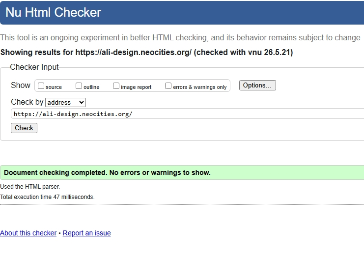
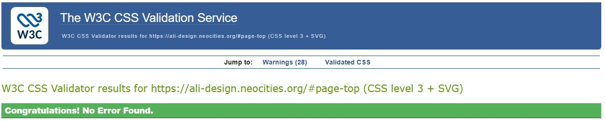

# Awesome Design — Portfolio Website

**Live Site:** [https://ali-design.neocities.org/](https://ali-design.neocities.org/)  
**Repository:** [https://github.com/Md12Ali/Awesome-Design](https://github.com/Md12Ali/Awesome-Design)  
**Author:** Mohammed Ali  
**Unit:** Unit 1 – User Centric Front End Development (Y/650/3525)

  

## 1. Project Overview
Awesome Design is a professional single-page portfolio website built to showcase my skills as a Designer and Front-End Developer to potential clients, employers, and collaborators.

The site features a clean, modern, and fully responsive layout with smooth scrolling navigation across five main sections: Hero, About, Services, Portfolio, and Contact.

## 2. UX Design

### User Stories with Acceptance Criteria

| User Story | Acceptance Criteria | Verified |
|------------|---------------------|----------|
| As a new visitor, I want to immediately understand the purpose of the site | Clear hero section with headline and call-to-action | Yes |
| As an employer, I want to see services and real projects | Dedicated Services and Portfolio sections with screenshots | Yes |
| As a mobile user, I want the site to work well on my device | Fully responsive layout using Bootstrap grid | Yes |
| As an accessibility user, I want proper support | Descriptive alt text, working links, good contrast | Yes |

### User Stories with Acceptance Criteria
- **As a new visitor**, I want the site's purpose to be immediately evident.  
  *Acceptance Criteria:* Strong hero section with clear headline and call-to-action. **Verified:** Yes.
- **As an employer/recruiter**, I want to easily view services and portfolio examples.  
  *Acceptance Criteria:* Dedicated Services and Portfolio sections with real project screenshots. **Verified:** Yes.
- **As a mobile user**, I want a fully responsive layout.  
  *Acceptance Criteria:* Site adapts correctly across all devices. **Verified:** Yes.
- **As an accessibility-dependent user**, I want high contrast and descriptive alt text.  
  *Acceptance Criteria:* Proper alt attributes on all images and good contrast. **Verified:** Yes.

  ## Core Design Principles

The design of this portfolio website is guided by key UX and UI principles to ensure clarity, accessibility, and a smooth user experience across all devices.

### 1. Simplicity
The layout avoids unnecessary complexity, focusing on clean sections, clear typography, and intuitive navigation. Users can quickly understand the purpose of the site without distractions.

### 2. Consistency
Consistent spacing, colours, typography, and iconography are used throughout the site. This creates a unified visual identity and helps users predict how elements behave.

### 3. Accessibility
Accessibility was prioritised through:
- Descriptive alt text for all images  
- High‑contrast colour combinations  
- Keyboard‑friendly navigation  
- Clear link labels and readable font sizes

These choices ensure the site is usable for a wide range of users, including those with visual or motor impairments.

### 4. Mobile‑First Responsiveness
The design was planned and built using a mobile‑first approach. The layout adapts seamlessly across mobile, tablet, and desktop devices using Bootstrap’s responsive grid system.

### 5. Visual Hierarchy
Content is structured using headings, spacing, and typography to guide the user’s eye. Important elements such as the hero headline, call‑to‑action buttons, and portfolio items are emphasised visually.

### 6. User Control & Clarity
Navigation is always visible, links behave predictably, and interactive elements provide visual feedback. This ensures users always know where they are and how to move through the site.

### 7. Performance & Efficiency
Images are optimised, scripts are lightweight, and the layout avoids unnecessary animations. This ensures fast loading times and smooth performance on all devices.

### 8. Purpose‑Driven Content
Every section serves a clear purpose:
- Hero: Introduce the brand  
- About: Explain who I am  
- Services: Show what I offer  
- Portfolio: Display my work  
- Contact: Provide a simple way to reach me  

## Wireframe Structure

The wireframes for this project were created during the planning phase to establish a clear visual structure before development began. They were designed in Adobe Photoshop and follow a mobile‑first approach to ensure accessibility and responsiveness across all devices.

### Purpose of the Wireframes
The wireframes were created to:
- Define the layout and hierarchy of each section
- Plan how content flows from top to bottom
- Ensure consistent spacing, alignment, and readability
- Visualise how the design adapts across desktop, tablet, and mobile
- Identify potential usability issues early in the process

### Structure Overview
Each wireframe includes the following core elements, accurately matching the three uploaded wireframes:

#### **1. Header & Navigation**
- Fixed navigation bar at the top  
- Logo positioned on the left  
- Menu links: **Home, About, Portfolio, Services, Contact**  
- Designed to collapse into a mobile menu in smaller screens  

#### **2. Hero Section**
- Large headline for immediate clarity  
- Subheading text directly underneath  
- A **“Learn More”** button (not a call‑to‑action button)  
- Clean, minimal layout to introduce the site  

#### **3. Portfolio Section**
- Prominent section title: **Portfolio**  
- Desktop wireframe: **8 portfolio items** arranged in two rows  
- Tablet wireframe: **4 portfolio items**  
- Mobile wireframe: **3 portfolio items**  
- Consistent placeholder boxes labelled “Portfolio Item”  
- Designed for hover or click interaction in the final build  

#### **4. About Section**
- Two‑column layout  
  - Left: Profile image placeholder  
  - Right: “About Me Text” block  
- Additional horizontal bars representing supporting text or skills  
- Clear introduction to the creator  

#### **5. Services Section**
- Three service blocks displayed horizontally  
- Each block includes:
  - A user icon  
  - A service title (Service One, Service Two, Service Three)  
- Tablet and mobile versions stack vertically for readability  

#### **6. Contact Section**
- Simple, accessible layout  
- Email address displayed clearly  
- Social media icons included (Twitter, Facebook, Email)  
- Designed for quick communication  

#### **7. Footer**
- Clean footer containing:  
  **© Mohammed Ali – Awesome Design**  
- Consistent across all wireframe versions  

### Wireframe Goals
The wireframes were designed to meet the following goals:
- Ensure navigation remains visible and accessible  
- Present portfolio items clearly and professionally  
- Provide a clean, simple contact method  
- Maintain consistent structure across desktop, tablet, and mobile  
- Support a smooth user journey from introduction → portfolio → contact  

### Wireframe Images
Below are the final low‑fidelity wireframes used during development:

### Homepage Wireframe

*Alt: Low‑fidelity wireframe showing hero banner, navigation, about, services, portfolio, and contact layout.*

### Portfolio Wireframe

*Alt: Wireframe showing responsive grid layout for project thumbnails.*

### Contact Section Wireframe

*Alt: Wireframe showing simple contact block with email link.*

### Wireframe Acceptance Criteria
- Layout must remain consistent across desktop, tablet, and mobile.
- Navigation must remain visible and accessible.
- Portfolio images must display clearly with hover or click interaction.
- Contact section must provide clear communication options.

## 3. Features
- Fixed navbar with hamburger menu and smooth anchor scrolling
- Hero section with strong value proposition
- About section highlighting professional background
- Responsive services grid with icons
- Interactive portfolio gallery with lightbox effect
- Contact section with working email and phone links
- Hover effects and professional visual feedback

### **Existing Features**
- Responsive navigation bar  
- Hero section with call‑to‑action  
- Portfolio gallery  
- About section  
- Services section  
- Contact section with working email link  
- Footer with copyright  
- Fully responsive layout  
- External links opening in new tabs  
- All images renamed to lowercase  
- All images include descriptive alt text  

### **Future Features**
- Dark mode  
- Interactive gallery  
- Contact form with validation  

## 4. Technologies Used
- **HTML5** – Semantic markup
- **CSS3** – Custom styles and overrides
- **Framework:** Bootstrap 4.5.3 (grid system, navbar, responsiveness)
- **Typography:** Google Fonts – Merriweather and Merriweather Sans
- **Icons:** Font Awesome 5.15.1
- **Interactivity:** jQuery, Magnific Popup
- **Tools:** Adobe Photoshop & Illustrator, Git/GitHub, Neocities

## 5. Credits & Attribution
This project was built by **customising two Start Bootstrap templates**. Using templates is normal and acceptable in web development.

### Templates Used
- **Start Bootstrap – Creative v6.0.4** (MIT License) – Core structure, masthead, navigation, `styles.css`, and `scripts.js`
- **Start Bootstrap – Stylish Portfolio v5.0.9** (MIT License) – Portfolio and services styling (`stylish-portfolio.css`)

### What I Customised (My Own Work)
- All personal text content (About, Services, Contact)
- Portfolio gallery with my own project screenshots
- Custom logo design and integration
- Colour scheme adjustments to match my branding
- Accessibility improvements (alt text, mailto links, `target="_blank"`)
- File renaming to lowercase with descriptive names
- Custom CSS overrides in `css/custom.css`
- Full documentation and testing

**External Resources:** Bootstrap 4.5.3, Google Fonts, Font Awesome, Magnific Popup.

### AI Assistance Acknowledgement
Parts of this project’s documentation were supported by Microsoft Copilot, which assisted with:
- README structuring and clarity improvements
- Grammar and formatting corrections
- Accessibility and validation guidance
- General development support

All design decisions, code implementation, customisations, and final content were created and approved by me.

## 6. Testing
**Validation Evidence:**
- HTML passes W3C Validator → 

- Alt: Screenshot showing W3C HTML validation with no errors.
- CSS passes Jigsaw Validator → 

- Alt: Screenshot showing Jigsaw CSS validation with no errors.

**Manual Testing Summary:**

### **Manual Testing Table**

| Feature | Test | Expected Result | Actual Result | Pass |
|--------|------|----------------|----------------|------|
| Navigation links | Click each link | Smooth scroll to section | Works correctly | ✔ |
| External links | Click GitHub/Neocities | Opens in new tab | Works | ✔ |
| Email link | Click email | Opens mail client | Works | ✔ |
| Images | Load on all devices | Display correctly | Works | ✔ |
| Responsiveness | Resize browser | Layout adjusts | Works | ✔ |
| Alt text | Inspect images | Alt text present | All correct | ✔ |

### **Device Testing**
- iPhone 12  
- Samsung Galaxy S21  
- iPad 10th Gen  
- Windows laptop  
- MacBook Air  

### **Browser Testing**
- Chrome  
- Firefox  
- Safari  
- Edge

### Acknowledgments
I would like to express my sincere gratitude to my assessor, Yassin Hassan, for the constructive feedback and clear guidance provided during the assessment process. These insights were instrumental in helping me improve the accessibility, documentation, and technical compliance of this portfolio.

I also acknowledge the Start Bootstrap team for their high-quality, open-source templates, which provided the foundational structure for this project, and the broader web development community for the documentation that supported my learning journey.

## 7. Bugs Fixed
| Bug                          | Fix Applied                     | Status |
|-----------------------------|---------------------------------|--------|
| Navbar overlap on mobile    | CSS media queries               | Fixed  |
| Broken email link           | Added `mailto:` prefix          | Fixed  |
| Capitalised image filenames | Renamed to lowercase            | Fixed  |

## 8. Deployment
The website is live on **Neocities** at: [https://ali-design.neocities.org/](https://ali-design.neocities.org/)

### Deployment Steps
The site is deployed using **Neocities**.

### **Steps:**
1. Create a Neocities account  
2. Upload all project files  
3. Ensure folder structure matches GitHub  
4. Publish the site  

## 9. How to Run Locally

1. Clone the repository  
2. Open `index.html` in any browser  
3. No installation required  

---

## 10. Contact

**Mohammed Ali**  
Email: **mohammed_12ali@outlook.com**
